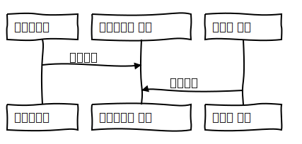

# 1강. 프로그래밍 언어 소개

### 1. 프로그래밍 언어란 무엇인가?

- 프로그래밍 언어 정의

  - 언어란 무엇인가?

    - `의사 전달 수단`
    - `한 사람의 생각`을 `다른 사람에게 전달`하는 데 사용
    - 자연어는 크게 `말`과 `글`, 두 가지 형태로 존재

  - 프로그래밍 언어란 무엇인가 ?

    - `프로그램 작성`에 사용되는 언어

      > `프로그램`이란 ?
      >
      > - 컴퓨터가 수행할 명령어를 순서대로 나열해 둔 것

    - 역시 `의사 전달 수단`

    - 주로 `사람의 생각`을 `기계에 전달`하는데 사용

    - 하지만 `사람도 고려`해야 함

  - 프로그래밍 언어 정의

    - 프로그래밍 언어는 `컴퓨터가 수행할 수 있고 사람이 읽을 수 있는 형태`로 `계산을 나타내는 표기 체계이다`

  - 프로그래밍 언어의 특징

    - |              |                ***자연어***                |            ***프로그래밍 언어***             |
      | :----------: | :----------------------------------------: | :------------------------------------------: |
      |  ***형식***  |                 `말과 글`                  |                  `주로 글`                   |
      |  ***내용***  |               `모호`, `함축`               |         `엄밀한 규칙`, `정확한 의도`         |
      | ***방향성*** | `양방향`<br />사람 → 사람<br />사람 ← 사람 | `단방향`<br />사람 → 컴퓨터<br />사람 → 사람 |

  - 프로그래밍 언어를 배워야 하는 이유

    > 내 언어의 한계가 내 세상의 한계이다. *[루트비히 비트겐슈타인]*

    - 프로그래밍에 대한 `사고 능력을 확장`시켜 줌
    - 문제 해결자로서 `현명하게 언어를 선택`할 수 있도록 해 줌
    - 언어 사용자로서 `언어를 자세히 배울 수 있도록` 해 줌
    - `현명한 관리자`, `현명한 설계자`가 될 수 있도록 함

  - 프로그래밍을 배워야 하는 이유

    >모든 사람은 프로그래밍을 배워야 합니다.
    >
    >프로그래밍은 우리에게 생각하는 방법을 가르쳐 주기 때문입니다. *[스티브 잡스]*

    - `체계적으로 생각하는 방법`을 가르쳐 줌
    - `변화를 표현하는 방법`을 가르쳐 줌

    

### 2. 프로그래밍 언어의 기능

- 프로그래밍 언어의 기본 기능

  - `작성력` : 프로그래머의 `의도를 나타낼 수 있도록 하는 기능`
  - `가독성` : 프로그램을 `쉽게 해독할 수 있도록 하는 기능`
  - `실행 가능성` : 컴퓨터에서 `실행될 수 있도록 하는 기능`

- 프로그래밍 언어의 부가 기능

  - `추상화` : `어떤 대상을 간략하게 추려` 나타내는 방법
  - `모듈화` : `복잡한 대상을 나누어 구성`할 수 있는 방법

- 프로그래밍 언어의 특성

  - `기계적` : `기계적으로 처리`할 수 있어야 함
    - `엄밀한 규칙`에 따라`정의
  - `구조적` : `복잡한 구조`를 나타낼 수 있어야 함
    - `자료 구조`, `제어 구조`
  - `가변적` : `시대의 필요에 따라 바뀔 수 있음`
    - `Python : 명령형 언어 → 객체지향 개념 탑재`

- 프로그래밍 언어 스펙트럼

  - 

  - 프로그래밍 언어가 컴퓨터 구조에 친숙한 쪽이냐, 프로그래머에 친숙한 쪽이냐에 따라서 언어 스펙트럼이 달라진다.

  - 컴퓨터 구조에 가까우면 어셈블리어, 프로그래머에 친숙한 쪽이면 Python이다. C는 프로그래머와 컴퓨터구조 둘다 중립적으로 친숙하다고 볼 수 있으며, 고급언어이지만 고급언어에서 저급언어에 속한다.

  - `저급 언어` - 추상화가 거의 되어 있지 않은 언어

    - `기계에 종속적`인 언어
    - `기계어`, `어셈블리어`

  - `고급 언어` - 얼마나 추상화가 잘 되어 있느냐

    - `기계 독립적으로 정의`되고 실행될 수 있는 언어
    - C, Java, Python 등

    

### 3. 프로그래밍 언어의 구성 요소

- 데이터

  - 데이터란 ?
    - `자료를 프로그램이 처리할 수 있는 형태`로 나타낸 것
    - `수`, `문자`, `문자열`, `멀티미디어` 등
  - *데이터 분류*
    - `이진 데이터` : `이진수의 나열`로 이루어진 데이터
    - `텍스트 데이터` : `문자열`을 나타내는 데이터

- 연산

  - 연산이란 ?
    - `데이터 처리 방법`
    - `연산 적용 후 새로운 데이터를 결과로 얻음`
  - *용어 정의*
    - `연산자` : 특별한 `연산을 수행하는 함수` ex) +, -, /, *, ==, !== 등
    - `변수` : `연산 결과를 저장하는 이름`
  - 연산 표현 구조
    - `수식` : `값`을 나타내는 표현
    - `문장` : `처리`를 나타내는 표현

- 명령어

  - 명령어란 ?
    - `특정 작업을 지시하는 단어`
    - if, while 등

- 연산 및 명령어

  - 연산 및 명령어란 ?

    - 대부분의 `프로그래밍 언어`는 다양한 `연산자`와 `명령어`를 통해 `수식`과 `문장`을 구성

  - 연산의 종류

    - `원시연산` : `언어가 기본적으로 제공`하고 있는 연산

      - +, *, /, -, %, =, ==, != 등

    - `사용자 정의 연산` : 프로그래머가 추가로 정의한 연산

      - ```c
        int add(x, y) {
        	return x + y;
        }
        ```

    - `라이브러리` : 사용자가 자주 사용할 만한 연산을 미리 정의해 둔 것

- 서브프로그램

  - 서브프로그램이란?
    - 전체 프로그램을 이루는 `작은 코드 블록에 이름을 붙인 것`
    - `서브루틴`이라고 부르기도 함
  - 서브프로그램 분류
    - `함수` : 연산 수행 `결과 값을 반환`하는 서브프로그램
    - `프로시저` : `결과 값을 반환하지 않는` 서브프로그램

- 타입

  - 타입이란?
    - `데이터 집합`과 `연산 집합`을 합친 개념
      - 데이터 타입 → int, char, double 등등
    - `연산의 안전성 보장`을 위해 필요
  - 타입 안전성
    - 함수 f의 타입이 f(x) : A → B
    - 모든 a ∈ A에 대해 f(a) ∈ B여야 함
  - 프로그래밍 언어의 분류
    - `강타입 언어` : `타입 오류를 모두 검출`하는 언어
    - `약타입 언어` : `일부 타입 오류를 허용`하는 언어
    - `무타입 언어` : `타입 선언문도 없고` 어떤 `대상의 타입이 계속 변경`될 수 있는 언어

- 모듈

  - 모듈이란?
    - `독립적`인 `프로그램 구성 단위`
    - 서브프로그램도 모듈의 일종
  - 특징
    - `내부`와 `외부`를 구별하며 `독자적인 이름 공간을 차지`
    - `변수`, `함수`, `타입` 등 프로그래밍 언어에서 제공하는 `거의 모든 것을 포함하는 단위`

### 4. 프로그래밍 언어의 학습 방법

- 프로그래밍 언어의 두 가지 측면

  - `프로그램 형태` + `수행 과정`

- 프로그램 형태

  - `작성한 프로그램`
  - `데이터`
  - `연산`
  - `구문론` 이라고 말할 수 있다.

- 수행 과정

  - `실행 시 프로세스`
  - `메모리`
  - `수행 흐름`
  - `의미론` 이라고 말할 수 있다.

- 어떻게 프로그래밍 언어를 배워야 하나

  - `좋은 프로그램을 많이 읽어야 함`
  - `프로그램을 많이 작성해 봐야 함`
  - `직접 실행해 보며 많이 생각해 봐야 함`

- 프로그래밍 언어의 선택 방법

  - `초보자`

    - 자신이 `조금이라도 아는` 언어
    - `사용해 볼 수 있는` 언어
    - `주위에서 정보를 얻을 수 있는` 언어
    - 프로그램을 `관리하기 쉬운` 언어

  - `숙련자`

    - 자신의 `업무 분야에서 사용되는 언어`
    - 자신이 `아는 언어와 유사한 언어`

  - 프로그래밍 어어의 학습 요령

    - `눈보다 손`
    - `그림으로 생각`
    - `점진적으로 변경`

  - 왜 `프로그래밍 언어론`을 배워야 하나?

    - `새로운 프로그래밍 언어를 쉽게 습득`하기 위해서
    - 내가 `사용하는 언어를 더 잘 이해`하기 위해서
    - `현명한 언어 설계자`가 되기 위해서

    ```c
    #include <stdio.h>
    int main() 
    {
        print_f("%d students. \n",
               printf("Good ") + printf("morning "));
        return 0;
    }
    // 출력 값 = Goods morning 13 students.
    
    ----------------------------------------------
        
    #include <stdio.h>
    int add(int a, int b)
    {
        return a + b;
    }
    
    int main() {
    	printf("%d students.\n",
              add(printf("Good "), printf("morning")))   
    }
    // 출력 값 = morning Goods 13 students.
    ```

    

