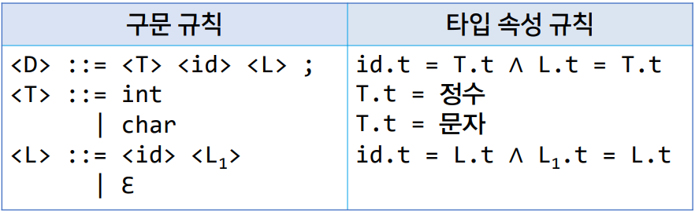

# 4강. 구문론과 의미론


## 1. 구몬론과 의미론

- 언어의 형식적 정의

  > 구몬론과 의미론을 통해 언어를 엄밀하게 정의

  > 구문론(syntax)
  >
  > - 문장이 구성되는 방식에 대해 연구

  > 의미론(semantics)
  >
  > - 문장이 나타내느 의미에 대해 연구

  - 예 : 나는 너를 사랑한다.

  > 구문 : 주어 + 목적어 + 서술어
  >
  > 의미 : 화자가 청자를 몹시 아끼고 귀중히 여긴다

  - 예 : I love you.

  > 구문 : 주어 + 동사 + 목적어
  >
  > 의미 : 화자가 청자를 몹시 아끼고 귀중히 여긴다.

- 프로그래밍 언어의 형식적 정의

  - 프로그래밍 언어의 `명확한 구문과 의미`를 정의

  - 이를 통해 `명확한 사용체계`를 제공

  - 예 : PRINT "GCD is"; A ( BASIC 언어 )

    > 구문 : PRINT "출력할 내용"; 변수
    >
    > 의미 : 출력할 내용과 변수의 값을 순차적으로 출력하라

  - 예 : printf("GCD is %d", a);

    > 구문 : printf("출력할 내용", 변수);
    >
    > 의미 : 출력할 내용의 %d 자리에 변수의 값을 대신 넣어 내용을 출력하라

  - 형식적 정의의 필요성

    - 컴퓨터 : 프로그램 해석의 모호함 제거
    - 작성자 : 프로그램의 동작 예측 가능

  - 프로그래밍 언어의 형식적 정의

    ```
    int x12;
    x12 = 1 + 5 * 2;
    if x12>10 then ...
    ```

    - 프로그램의 구조

      > 문자 : 영엉 알파벳, 아라비아 숫자, 특수 기호 등
      >
      > 어휘(토큰) : 문자의 모임. 최소한의 의미를 갖는 단어
      >
      > 구문 : 프로그램을 작성하는 규칙
      >
      > 	- 토큰을 모아 프로그램을 구성

    - 프로그램의 의미

      > 의미 : 프로그램을 통해 발생하는 현상
      >
      > 	- 정수를 저장할 변수 x12를 만든 다음
      > 	- 수식을 계산하여 11을 변수 x12에 대입하고
      > 	- 변수 x12의 값이 10보다 크므로 ... 부분을 수행

    


## 2. 구문의 표현

- 구문론

  > - 프로그램의 `표면적인 구조를 정의`
  > - 정의된 구문을 통해 모든 `정상적인 프로그램을 도출`
  > - 작성된 프로그램이 `정의된 구문에 맞는 프로그램인지 확인`

  - 구문의 표현

    > - 구문의 정의는 문법을 활용하여 명확하게 표현
    > - 일반적으로 프로그래밍 언어에서는 `문맥 자유 문법`을 이용

- 문맥 자유 문법 (CFG : Context-Free Grammar)

  - 구성 요소
    - 비단말 기호 : 정의될 대상
    - 단말 기호 : 언어에서 직접 사용되는 표현
    - 시작 비단말 기호 : 언어에서 독립적으로 사용될 수 있는 단위
    - 규칙 : 비단말 기호를 단말 기호와 비단말 기호의 조합으로 정의
      - 각 규칙은 하나의 비단말 기호만을 정의
  - `<if문> ::= if <논리식> then <문장>`

- 문맥 자유 문법의 다양한 표현 방법

  - BNF
  - EBNF
  - 구문 도표

- BNF(Backus-Naur Form)

  - Algol의 구문을 정의하기 위해 사용된 표현법

  - 세 가지 메타 기호

    - ::= (정의)    | (택일)   <>(비단말 기호)

    

  - 문맥 자유 문법의 BNF 표현

    - 비단말 기호 : <>로 묶인 기호

    - 단말 기호 : 비단말 기호 및 메타 기호가 아닌 기호

    - 규칙 :  ::= 를 기준으로 왼쪽 부분을 오른쪽 부분으로 정의

      > <if문> ::= if <논리식> then <문장> else <문장> 
      >
      > ​			| if <논리식> then <문장>

- EBNF(Extended Backus-Naur From)

  - BNF에 추가적인 메타 기호를 사용하여 규칙을 보다 간결하게 표현

  - 추가된 메타 기호

    - [] (생략 가능)
    - {} (0번 이상 반복)
    - () (|과 함께 쓰여 한정된 범위의 택일)
    - ' ' (메타 기호를 단말 기호로 사용)

  - [] (생략 가능)

    >  <if문> ::= if <논리식> then <문장> [ else <문장> ]

    - BNF로 표현한다면?

      > <if문> ::= if <논리식> then <문장> else <문장> 
      >
      > ​			| if <논리식> then <문장>

  - {} (0번 이상 반복)

    > \<unsigned integer\> ::= \<digit\> { \<digit\> }

    - BNF로 표현한다면?

      > \<unsigned integer\> ::= \<digit\> 
      >
      > ​							| \<unsigned integer\>\<digit\>

  - ( ) ( |과 함께 쓰여 한정된 범위의 택일)

    > <수식> ::= <수식> ( + | - | * | / ) <수식>

    - BNF로 표현한다면?

      > <수식> ::= <수식> + <수식> | <수식> - <수식>
      >
      > ​			| <수식> * <수식> | <수식> / <수식>

  - ' ' (메타 기호를 단말 기호로 사용)

    > <BNF 규칙> ::= <왼쪽 부분> '::=' <오른쪽 부분>

- 구문 도표

  - 초기 Pascal의 사용자 설명서에 사용된 표현법

  - 순서도와 유사하게 그림으로 구문을 표현

    - 사각형 (비단말 기호)
    - 원 (단말 기호)
    - 화살표 (비단말 기호 및 단말 기호들을 연결. 규칙)

    

  - EBNF 표현

    > <if문> ::= if <논리식> then <문장> [ else <문장> ]

    - 해당 구문 도표

      

    > <수식> :: = <수식> ( + | - | * | / ) <수식>

    - 해당 구문 도표

      

    > \<unsigned integer> ::= \<digit\> { \<digit\> }

    - 해당 구문 도표

      


## 3. 의미의 표현

- 의미론

  - 프로그램의 `내용적인 효과`를 정의
  - 프로그램 실행 시 어떤 일이 일어나는지 그 의미를 기술
  - 구문으로 표현하기 어려운 제약사항을 기술하기도 함
  - 의미의 표현
    - 일반적으로 `자연어 문장`으로 표현하나 `명확성이 부족`
    - 의미의 `엄밀한 표현`을 위한 다양한 기법 개발(`형식 의미론`)

- 형식 의미론

  - 정적 의미론
    - `프로그램을 수행하기 전` 의미가 맞는지 파악하는 방법
    - 주로 `타입 검사` 수행에 활용
    - 대표적인 방법 : `속성 문법`
  - 동적 의미론
    - `프로그램 수행 시` 나타나게 될 `의미를 표현`하는 방법
    - 대표적인 방법 : `기능적 의미론`, `표기적 의미론`, `공리적 의미론` 등

- 속성 문법

  - `비 단말 기호`마다 `타입 속성이 있다고 가정`하고 `이에 대한 규칙을 정의`

    

    - 구문 규칙 
      - \<D\> ::= \<T\> \<id\> \<L\>  선언을 하는데 `타입 이름`, `변수 이름`, `변수 리스트`
      - \<T\> ::= int | char  타입이란 `int형` 또는 `char형`이다.
      - \<L\> ::= \<id\> \<L<sub>1</sub>\> | Ɛ  리스트는 하나의 변수가 나오고 또다른 리스트가 나온다. 혹은 리스트가 빌수도 있다. 입실론은 empty와 같다. 
    - 타입 속성 규칙
      - id.t = T.t ∧ L.t = T.t  
        - id의 타입속성이란 T의 타입속성을 따라가겟다.
        - L(리스트)의 타입들도 T의 타입속성을 따라가겠다.
      - T.t = 정수(int)
      - T.t = 문자(char)
      - id.t = L.t ∧ L1.t = L.t 
        - id 리스트의 타입을 따라가겠다
        - L1도 리스트의 타입을 따라가겠다.

- 기능적 의미론

  - `추상기계의 상태를 바꾸는 것`으로 `수행 의미`를 표현

    - 프로그램이 `수행(기능)`되면 `컴퓨터의 상태가 바뀜`

  - `상태 : <수행할 명령어, 메모리 상태>`

    

    - 순서
      - 대입하기 전 상태 x = 5, y = 7, z = 0;
      - z에 x값을 대입
      - x에 y값을 대입
      - y에 z값을 대입
      - 아래는 순서대로 실행한 것
    - < z=x; x=y; y=z; , [x→5, y→7, z→0] >
    - <       x=y; y=z; , [x→5, y→7, z→5] >
    - <             y=z; , [x→7, y→7, z→5] >
    - <                   , [x→7, y→5, z→5] >

- 표기적 의미론

  - 구문 요소를 수학적 표기에 대응시켜 수행 의미를 표현

  - 의미함수 : 대응시키는 함수

    

- 공리적 의미론

  - `프로그램의 효과로 수행의미를 표현`

  - 효과 : `프로그램 S`가 실행됨으로써 `사전조건 P`를 `사후조건 Q`로 변화시킴. {P} S {Q}

    

- 의미론의 한계 및 효과

  - 한계
    - 프로그래밍 언어 전체에 대한 의미 표현은 너무 복잡
  - 효과
    - 프로그램의 구현 및 분석 등에 유용하게 사용됨
    - 속성 문법 : 인터프리터 및 컴파일러 구현 시 트리생성, 타입검사, 코드생성 등을 할 대
    - 수학적 표기 : 언어의 특성을 명확하게 정의해야 할 때
    - 공리적 의미론 : 프로그램의 특정 조건 만족 여부를 확인할 때

  

