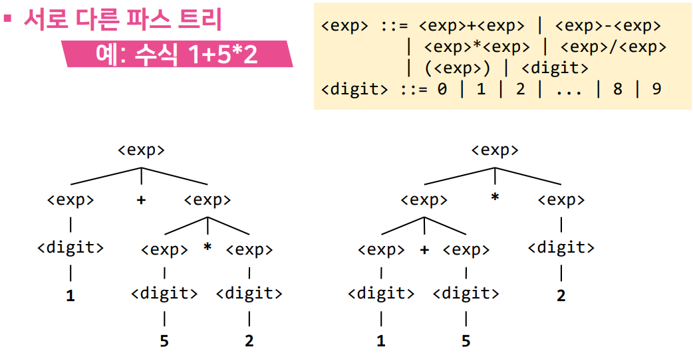

# 5강. 구문 분석

## 1. 어휘 분석

- 프로그램 분석

  ```
  int x12;
  x12 = 1 + 5 * 2;
  if x12>10 then ...
  ```

  - 문자 : i, n, t, x, 1, 2, ;, =, +, 5, f, >, ...
    ↓어휘 분석
  - 어휘 : int, x12, ;, =, 1, +, 5, if, >, 10, then, …
    ↓구문 분석
  - 구문: <선언문> ::= <자료형> <변수> ; 
           <대입문> ::= <변수> = <수식> ;

- 어휘 분석

  - 프로그램에서 사용된 단어를 구별해 냄

  - 토큰 : 어휘 분석을 통해 얻어지는 결과

    - `연산자, 구분자, 식별자, 예약어 등`

  - 연산자 

    - +, -, *, /, = 등

  - 구분자

    - ,(콤마), ;, [, ] 등

  - 식별자(identifier)

    - 변수나 함수 등의 이름을 나타내는 토큰

      - x12, printf 등

    - 전통적인 식별자 : `문자와 숫자`로 구성, `첫 글자는 문자`

       

  - 예약어
  
    - 프로그래밍 언어 자체에 정의되어 포함된 토큰
      - if, for, int 등
    - 식별자와 구문 구조가 같지만 식별자로 사용 못함
      - 사용자 재정의 불가

## 2. 파스 트리

- 구문 분석

  - 유도(derivation)

    - `구문 규칙`을 이용하여 주어진 `프로그램을 만들어` 내는 `과정`

    - 유도가 가능하면 `문법적 오류가 없는 유효한 프로그래밍`

      

      

  - 파스 트리(parse tree)

    - 유도를 트리 형태로 나타낸 것

    - 구조

      - 루트 노드 : 시작 비단말 기호
      - 비단말 노드 : 비단말 기호
      - 단말 노드 : 단말 기호

    - 단말 노드를 왼쪽부터 오른쪽으로 차례로 나열하면 주어진 프로그램이 됨

      

      

    - 주어진 표현에 대한 파스트리가 존재하면 구문에 부합하는 표현

    - 파스트리가 존재하지 않으면 오류 있는 표현임

      

      

      


## 3. 모호성

- 파스 트리

  - 주어진 표현에 대한 파스트리가 존재하면 구문에 부합하는 표현임
  - 만약 주어진 표현에 대한 파스트리가 여러 개 존재한다면?

  - 구문론 관점

    - 파스 트리가 존재하므로 구문에는 부합

  - 의미론 관점

    - 주어진 표현이 서로 다른 의미로 해석될 수 있음

- 서로 다른 파스 트리

  

  

- 모호한 문법

  - 동일한 표현에 대해 서로 다른 파스 트리가 만들어지는 문법
  - 문제점
    - 하나의 프로그램이 서로 다른 결과를 도출할 수 있음
    - 프로그래머의 의도와는 다르게 해석되어 잘못된 결과를 도출할 수 있는 위험을 내포

- 모호성 제거

  - 문법의 명확화

    - 의도하지 않은 의미로 해석되지 않도록 모호한 문법을 없애고 명확하게 변경
    - 새로운 비단말 기호와 새로운 구문 규칙을 추가하여 변경

  - 대표적인 예

    - 연산자 우선순위, 좌결합 연산자, 중첩된 if문의 else

  - 연산자 우선순위

    - +, - : 가장 낮음
    - *, / : 중간
    - () : 가장 높음

  - 모호한 문법

    

    

  - 좌결합 연산자

    - 우선순위가 동일한 연산자 사이의 계산 순서는 왼쪽이 우선

      

      

      

  - 중첩된 if문의 else

    - 중첩된 if문에서 else문의 개수가 if문의 개수보다 적은 경우 else문을 어느 조건이 거짓일 때 수행해야 하는지 모호

      

      

    - else 문 앞에 나온 if문들 중 다른 else 문과 짝이 되지 않은 가장 가까운 if문과 짝이 되도록 함

      

      

      