# 6강. 프로그래밍 언어의 구현

## 학습목차

1. 프로그래밍 언어 정의와 구현
2. 프로그래밍 언어 구현 방법
3. 언어 구현 실제

## 1. 프로그래밍 언어 정의와 구현

### 프로그래밍 언어 정의

> 구문 규칙 + 의미 규칙

- 구문 규칙
  - 어떤 프로그램이 올바른 형태인지 규정하는 것
- 의미 규칙
  - 올바른 형태의 프로그램을 실행하였을 때 어떻게 실행되는 것이 올바른 것인지 규정하는 것
- 구문 규칙 정의
  - 문맥 자유 문법, BNF, EBNF, 구문 도표 등
  - 문맥 자유 문법과 EBNF를 주로 사용
- 의미 규칙 정의
  - 기능적 의미론, 표기적 의미론, 공리적 의미론
  - 자연어를 주로 사용

### 프로그래밍 언어 정의 예 : 로봇 제어 언어

- 구문 규칙

  > \<program\> ::= { forward | left | right }

- 의미 규칙

  - forwart : 로봇이 향하고 있는 방향으로 1만큼 이동
  - left : 로봇이 왼편으로 90도 회전
  - right : 로봇이 오른편으로 90도 회전

### 프로그래밍 언어 구현

- 그 언어로 작성된 프로그램을 수행하는 프로그램
- 프로그래밍 언어 L의 구현
  - 다음을 수행하는 프로그램
    1. PL이 L의 구문 규칙을 따르는 올바른 프로그램인지 검사 (PL : 언어 L로 작성된 프로그램)
    2. 올바른 경우, PL을 입력으로 받아서 L의 의미 규칙에 따라 실행

- CPU의 함수 모형
  - M\[\[PM\]\]\(in\) = out
    - M : CPU가 받아들이는 기계어
    - PM : 기계어로 작성된 프로그램
    - in : 입력 데이터
    - out : 출력 데이터
- 프로그래밍 언어 구현의 함수 모형
  - L\[\[PL\]\]\(in\) = out
    - L : 프로그래밍 언어
    - PL : L로 작성된 프로그램
    - in : 입력 데이터
    - out : 출력 데이터

### 프로그래밍 언어 정의와 구현

### 프로그래밍 언어 구현 형태

- 인터프리터의 함수 모형
  - IntL\[\[PL\]\]\(in\) = out
    - IntL : 언어 L의 명령어를 해석하는 인터프리터
- 컴파일러의 함수 모형
  - CompL\[\[L\]\] = PM → M\[\[PM\]\]\(in\) = out
    - CompL : 언어 L의 컴파일러
    - PM : CPU M이 이해하는 프로그램

### 프로그래밍 언어 구현 개요

- 전통적인 프로그래밍 언어 구현
  - 대상 : 명령형 언어, 절차형 언어, 객체지향 언어
  - 기계어를 확장하는 형태로 구현
- 새로운 패러다임의 언어 구현
  - 대상 : 함수형 언어, 논리 언어
  - 구현 모델을 추상기계로 만들어 징검다리 삼아 구현

#### 전통적인 프로그래밍 언어 구현

- 명령형 언어
  - 저급언어의 연산과 명령어를 확장하는 형태로 구현
- 절차형 언어
  - 명령형 언어 + 사용자 정의 연산(함수)과 사용자 정의 명령어(프로시저)를 지원하는 형태로 구현
- 객체지향 언어
  - 절차형 언어 + 사용자 정의 자료형을 지원하는 형태로 구현

#### 새로운 패러다임의 프로그래밍 언어 구현

- 언어별 계산 모델
  - 함수형 언어 : 람다 계산법
  - 논리 언어 : 연역 논리
- 저급 언어와 연관성을 직접 파악하기 어려움
- 계산 모델과 하드웨어 사이에 중간 기계(추상기계)를 하나 더 놓는 형태로 구현
- 프로그램을 추상기계가 알아듣는 형태로 변경
- 추상 기계
  - 함수형 언어 : CPS, G-machine, TIM 등
  - 논리 언어 : WAM 등
- 가상 기계
  - 추상 기계가 구체적인 구현물로 제시되고 코드를 독자적으로 수행할 수 있는 경우
  - 대표적인 경우가 JAVA에 JVM이다. 이식성을 좋게 하기 위해 만들어짐

### 컴파일러 구현 단계

#### 분석 단계 (전단부)

- 프로그램의 구조 파악
- 중간 표현 생성
- → 프로그래밍 언어에 종속적

#### 생성 단계 (후단부)

- 목적 기계에 적합한 명령어 생성
- 효율적인 목적 코드 생성
- → 목적 기계에 종속적

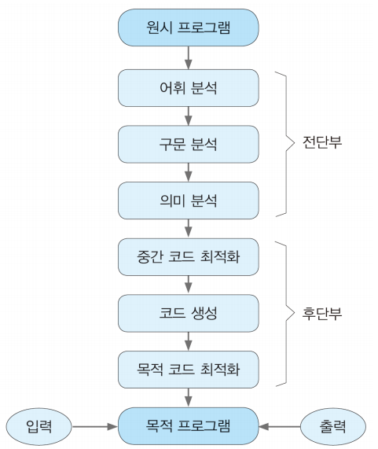

### 인터프리터 구현 단계

- 컴파일러 구현 단계의 분석 단계를 그대로 포함

- 중간 표현을 순회하며 프로그램을 수행

- 프로그래밍 언어의 문장 단위로 해석

  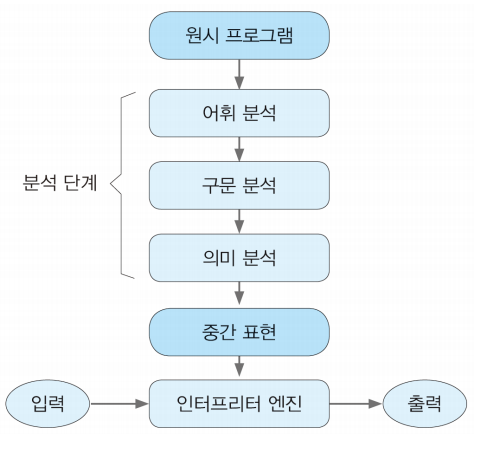

### 언어 구현에 필요한 자료 구조

- 구문 트리

  - 언어 구현 단계의 중심을 차지
  - 분석 단계의 전 과정을 관통

- 심볼 테이블(컴파일러 구현)

  - 식별자 정보(타입, 선언 위치 등)를 저장

- 환경(인터프리터 구현)

  - 값 정보를 포함한 식별자 정보를 저장

    

#### 실행 환경

- 실행을 지원하기 위한 메모리 구조
  - 정적 세그먼트 : 코드, 정적 데이터
  - 동적 세그먼트 : 스택, 힙
- 메모리 및 실행 상태를 관리하기 위한 레지스터
  - PC(프로그램 카운터), SP(스택 포인터), FP(프레임 포인터) 등 전용 레지스터
  - 여러 범용 레지스터

### 어휘 분석기 구현

- 어휘 분석기는 프로그램의 어휘(예약어, 리터럴, 연산자 등)를구별해 내고 속성을 구하여 구문 분석기에 전달
- 유한 상태 기계(FSM: Finite State Machine)를 구성하여 구현

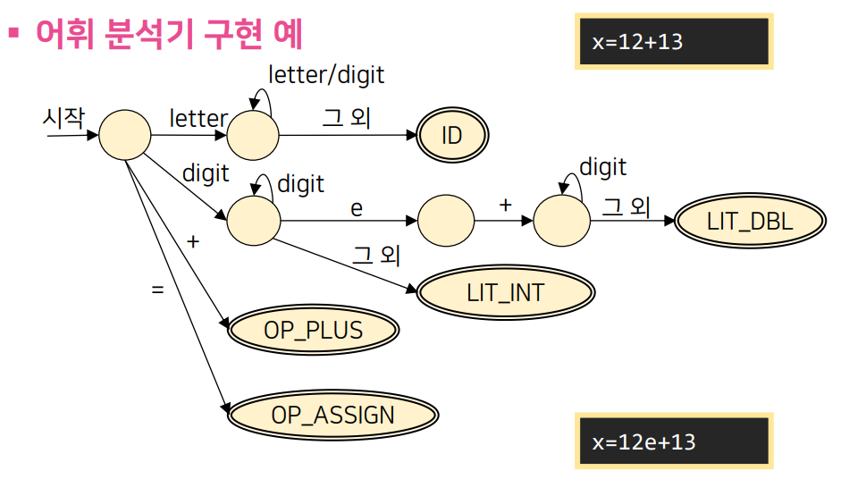

### 구문 분석기 구현

- 구문 분석기는 토큰 열로부터 구문 트리를 생성
- 구문 트리의 형태 : 파스 트리, 추상 구문 트리

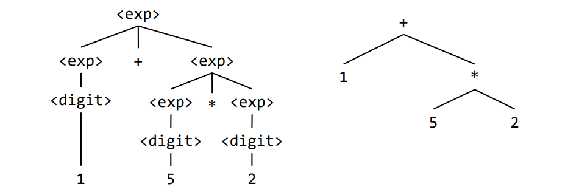

- 구문 트리를 순회하는 여러 프로시저로 구성된 프로그램
- 순환 하강 구문 분석기
  - 문법 규칙을 그대로 코드로 바꾼 형태
    1. 각 비단말 기호의 문법 규칙에 대해 하나의 프로시저 생성
    2. 우변을 모사할 때 단말 기호는 일치 검사, 비단말 기호는 해당 프로시저 호출

### 순환 하강 구문 분석기 예

- 괄호가 맞는 문자열을 생성하기 위한 문법

  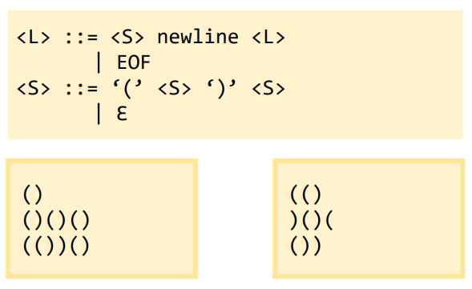

  

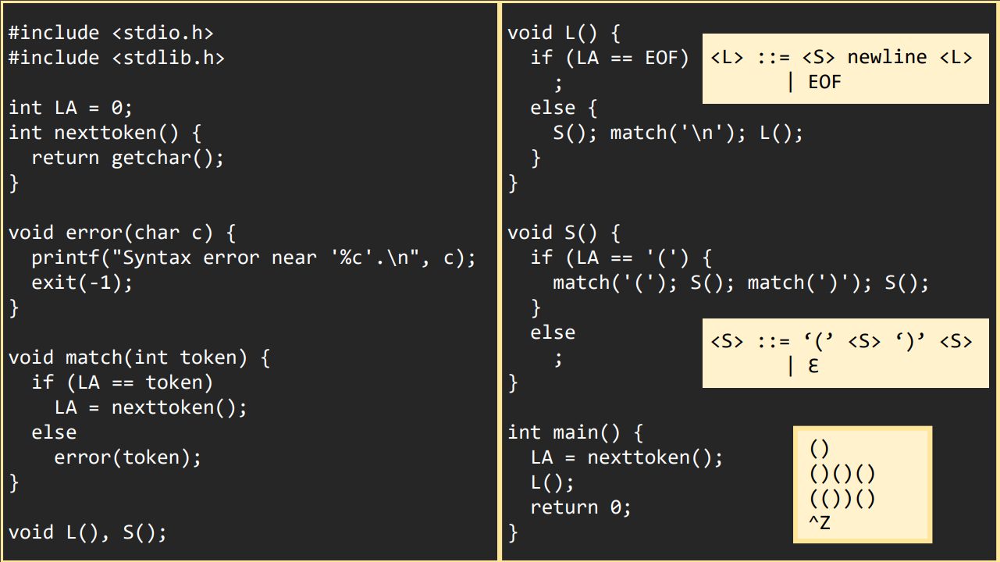

### 프로그래밍 언어 Koch

- 코크(Koch) 곡선을 그리는 로봇 제어 언어

- 코크 곡선

  - 스웨덴 수학자 헬리에 본 코크(Helge von Koch)가 1904년 제안한 프랙탈 곡선
  - 눈송이와 유사한 형태

- 로봇 제어 언어

  - 세 가지 명령어
    - forward : 로봇이 향하고 있는 방향으로 1만큼 이동
    - left : 로봇이 왼편으로 60도 회전
    - right : 로봇이 오른편으로 120도 회전

  > \<program> ::= { forward | left | right }

> 명령어 토큰 forward, left, right을 Koch 프로그램에서는 문자 F, L, R로 표현

- Koch 프로그램 예

  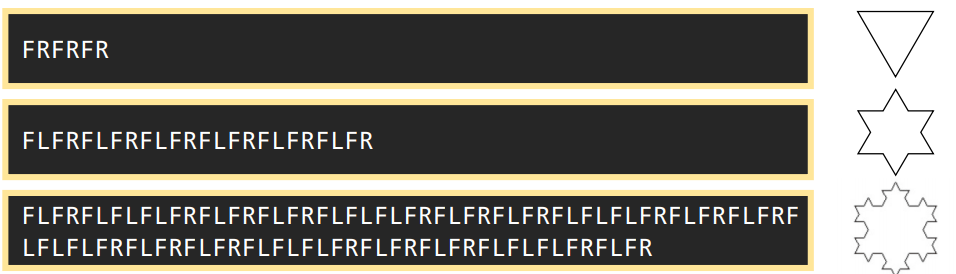

### Koch 인터프리터

- Koch 프로그램을 입력으로 받아서 실행하는 프로그램
- 결과로 코크 곡선이 생성됨
- 두 부분으로 구성
  - 드라이버 코드 : 실행 환경 설정, 인터프리터 엔진 호출
  - 인터프리터 엔진 : 원시 프로그램의 구문을 분석 및 수행

#### Koch 인터프리터 - 드라이버 코드

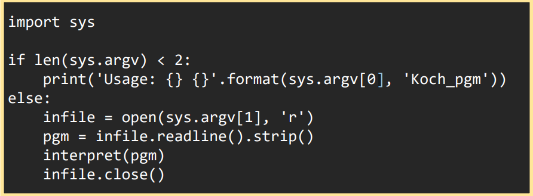

#### Koch 인터프리터 - 인터프리터 엔진

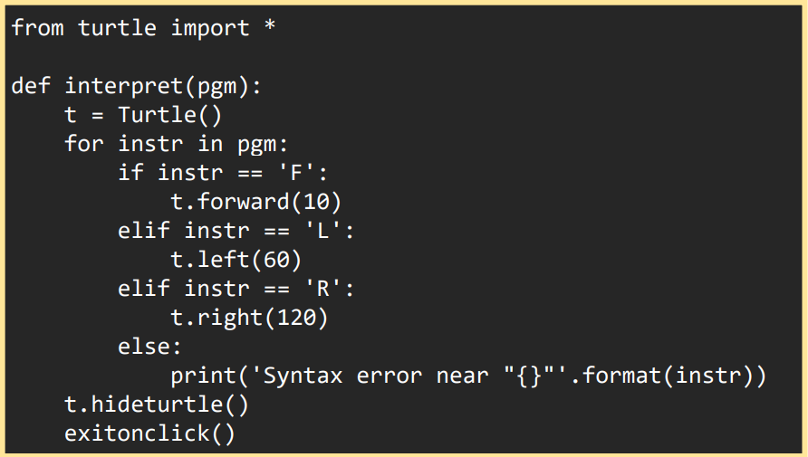

- kint.py : Koch 인터프리터
- *.kch : Koch 프로그램

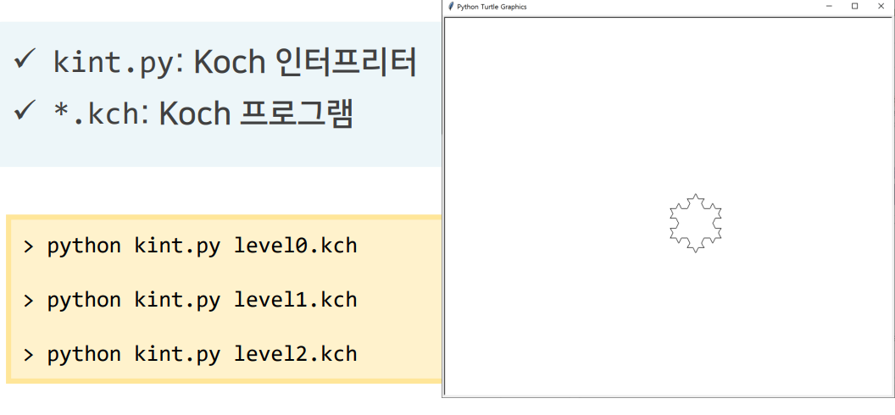

### Koch 컴파일러

- Koch 프로그램을 입력으로 받아서 코크 곡선을 그릴 수 있는 PyThon 프로그램(a.py)을 생성하는 프로그램
- 두 부분으로 구성
  - 드라이버 코드 : 설정 코드 생성, 컴파일러 엔진 호출 환경 구성, 컴파일러 엔진 호출
  - 컴파일러 엔진 : 구문 분석 및 코드 생성
- 설정 코드 : 컴파일된 코드의 실행 전과 후에 실행되는 코드

###  Koch 컴파일러 – 설정 코드

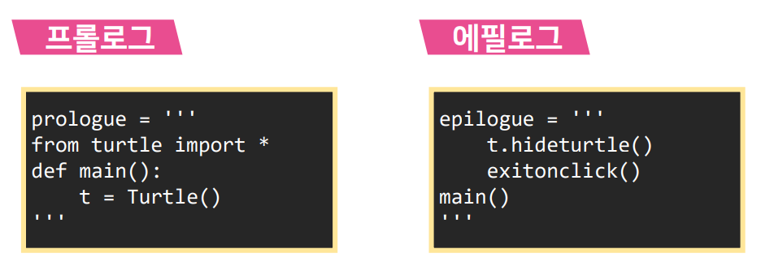

### Koch 컴파일러 – 드라이버 코드

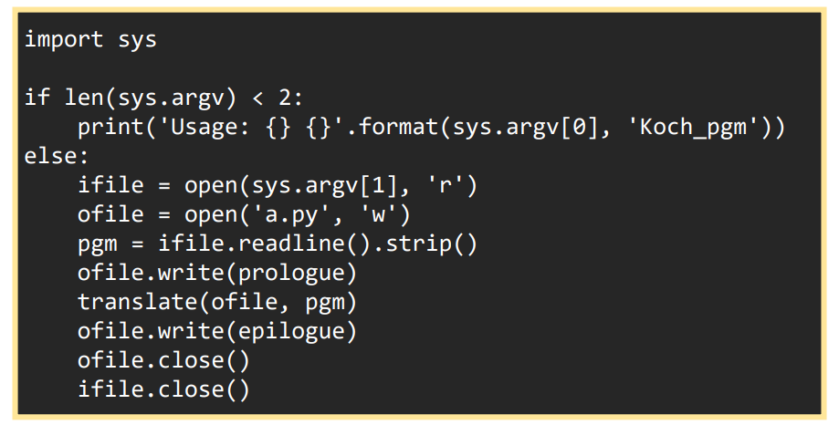

### Koch 컴파일러 – 컴파일러 엔진

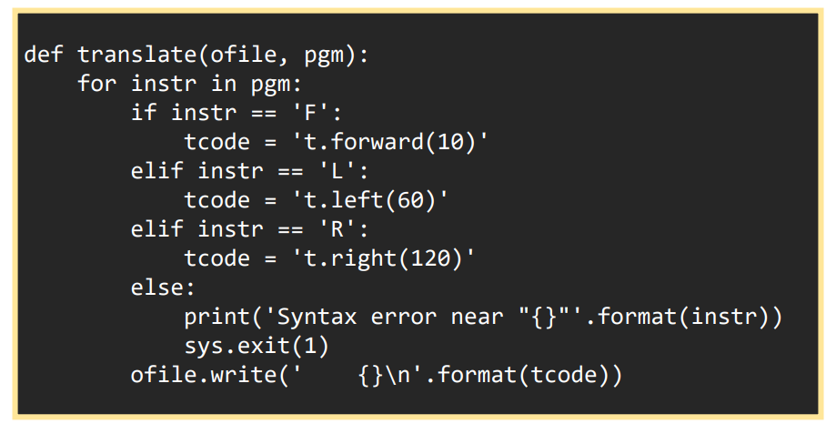

### Koch 컴파일러

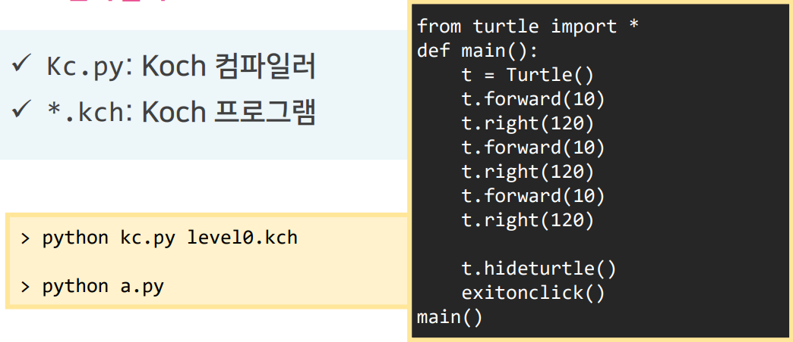

### Koch 컴파일러

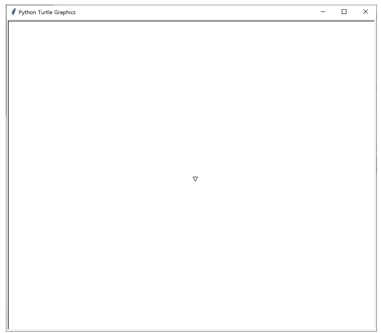

